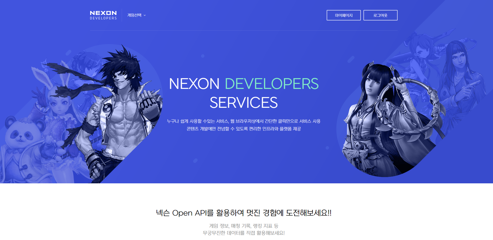
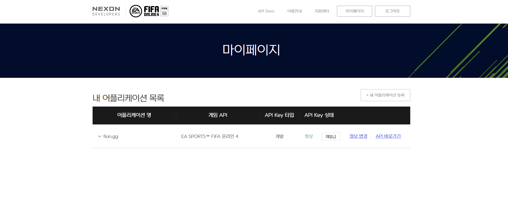
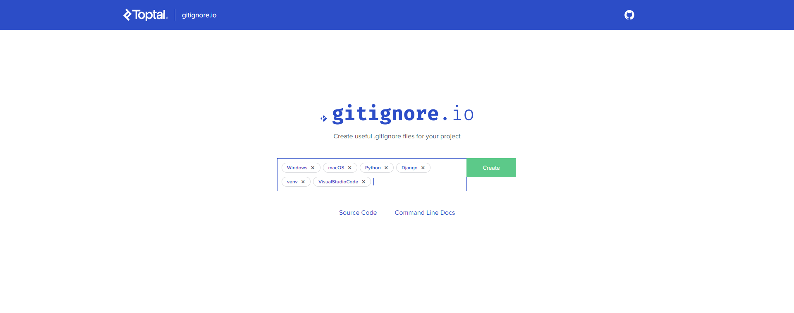

# FIFAONLINE  Toy Project

### Data based on NEXON DEVELOPERS

> NEXON DEVELOPERS에서 지원하는 Open API를 활용해서 토이프로젝트를 진행한다.

- 개발기간 : 2020.10.09 ~

- Project 참여자 : `김동욱(Donguk Kim)` 


# 1. NEXON DEVELOPERS Open API








# 1. DB Parsing


- mysqlclient

  - 설치

  ```bash
  $ pip install mysqlclient
  ```

  - settings.py

    > 원래는 sqlite3를 사용하는데 mysql로 바꿔준다. 지우지는 말고 custum_settings.py 만들어서 import해서 사용

  ```python
  DATABASES = {
      'default': {
          'ENGINE': 'django.db.backends.sqlite3',
          'NAME': BASE_DIR / 'db.sqlite3',
      }
  }
  
  # 아래처럼 변경
  
  import custom_settings
  
  DATABASES = custom_settings.DATABASES
  ```

  

  ```python
  DATABASES = {
      'default' : {
          'ENGINE': 'django.db.backends.mysql',    
          'NAME': 'fifaonline',                     
          'USER': 'root',                          
          'PASSWORD': '1234',                  
          'HOST': 'localhost',                     
          'PORT': '3306',                          
      }
  }
  ```

  - 내가 사용할 Mysql의 DB명은 fifaonline이므로 맞게 입력한다.


- django-csvimport(XXXXXXXX)

  ```bash
  $ pip install django-csvimport
  ```

  ```python
  INSTALLED_APPS = (
  	...
  	'csvimport.app.CSVImportConf',  # use AppConfig for django >=1.7 csvimport >=2.2
  )
  ```

  


## 1.1 선수 고유 식별자(spid) 메타데이터 조회


- 메타정보

###### API 정보

선수 고유 식별자(spid) 메타데이터를 조회합니다

선수 고유 식별자는 시즌아이디 (seasonid) 3자리 + 선수아이디 (pid) 6자리로 구성되어 있습니다.
시즌아이디는 / metadata/seasonid API로 조회할 수 있습니다.


# #개발 지원 TOOL

- gitignore.io

  > Github 형상관리 시 필요한 `.gitignore` 파일의 내용을 생성해준다.

  - `Windows`, `macOS`, `Python`, `Django`, `venv`, `VisualStudioCode`

  


## 2. 기능 설명


## 3. 개발 과정


## 4. 구현 결과사진

#### 


## 6. 개선 및 추가개발 예정 기능


